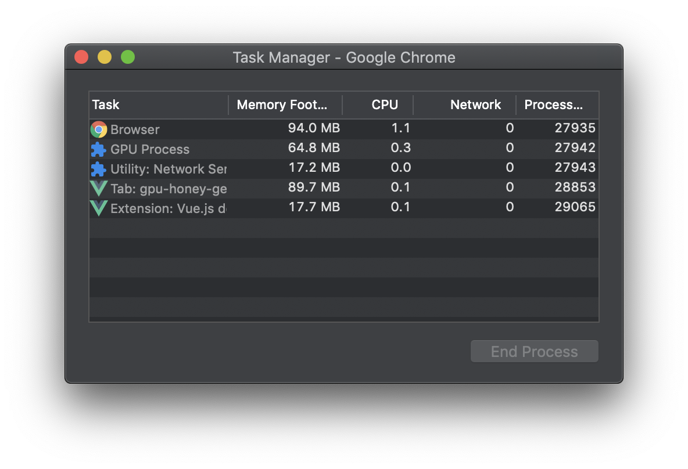
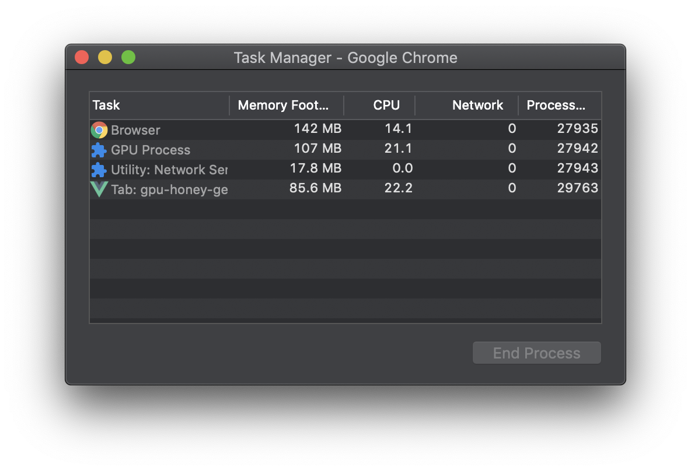
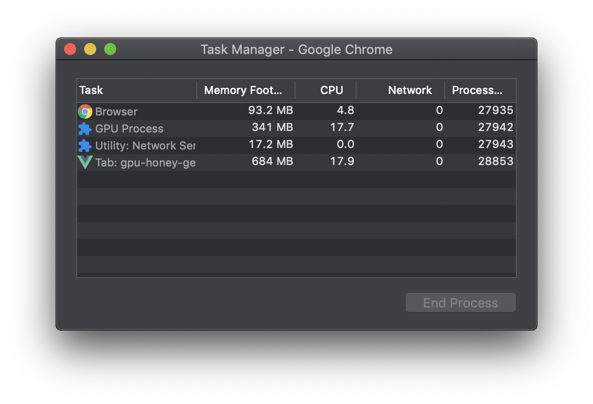

# GPU Memory Leak in Vue

> Browser에서 GPU 접근하는 작업은 메모리 누수에 주의해야한다. 특히 라우팅 변경을 할 때, 현재 연결된 GPU 메모리를 끊어주지 않으면 다음 라우팅에서도 그대로 남아서 메모리 누수가 발생한다.

---

## GPU 메모리 누수 발생 재현

### 재현 페이지 정보

| 1 초기 페이지                |                             |
| ---------------------------- | --------------------------- |
|  |  |
| GPU Memory :: 50~60MB        |                             |
|                              |                             |

##

| 2 렌더링 페이지              |                             |
| ---------------------------- | --------------------------- |
|  |  |
| GPU Memory :: 80~90MB        |                             |
|                              |                             |

##

| 3 렌더링 페이지              |                             |
| ---------------------------- | --------------------------- |
|  |  |
| GPU Memory :: 100MB          |                             |
|                              |                             |

### 메모리 누수 발생

| 1 -> 2 -> 1 -> 3 -> 1 -> 2 페이지 변경 |     |
| -------------------------------------- | --- |
|              |     |
| GPU Memory :: 341MB                    |     |
|                                        |     |

---

## 해결 방법

1. vue에서는 라우팅간의 메모리 누수 발생시 beforeDestroy() 라이프사이클에서 해결
   https://vuejs.org/v2/cookbook/avoiding-memory-leaks.html
2. three.js에서는 dispose()를 사용해서 GPU 메모리 제거
   - https://threejs.org/docs/#manual/en/introduction/How-to-dispose-of-objects
   - https://threejs.org/examples/?q=memory#webgl_test_memory
3. forceContextLoss()를 이용해서 강제로 renderer 자체를 지워 버린다.
4. window.cancelAnimationFrame()를 이용해서 requestAnimationFrame()을 제거

## code

```ts
  private beforeDestroy() {
    this.scene.dispose();
    this.renderer.dispose();
    this.renderer.forceContextLoss();
    window.cancelAnimationFrame(this.requestAnimationID);
    // @ts-ignore release force
    this.renderer.domElement = null;
    // @ts-ignore release force
    this.renderer = null;
  }
```
