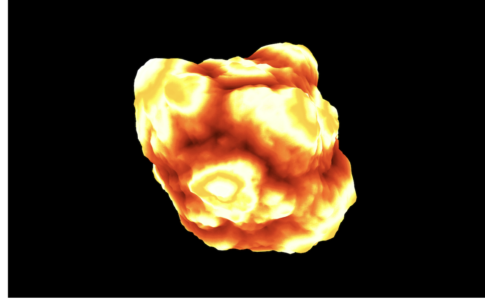

# GPU Memory Leak in Vue

> Browser에서 GPU 접근하는 작업은 메모리 누수에 주의해야한다. 특히 라우팅 변경을 할 때, 현재 연결된 GPU 메모리를 끊어주지 않으면 다음 라우팅에서도 그대로 남아서 메모리 누수가 발생한다.

---

## GPU 메모리 누수 발생 재현

### 재현 페이지 정보

| 1 초기 페이지                |                             |
| ---------------------------- | --------------------------- |
|  |  |
| GPU Memory :: 50~60MB        |                             |
|                              |                             |

##

| 2 렌더링 페이지              |                             |
| ---------------------------- | --------------------------- |
|  |  |
| GPU Memory :: 80~90MB        |                             |
|                              |                             |

##

| 3 렌더링 페이지              |                             |
| ---------------------------- | --------------------------- |
|  |  |
| GPU Memory :: 100MB          |                             |
|                              |                             |

###

| 1 -> 2 -> 1 -> 3 -> 1 -> 2 페이지 변경 |     |
| -------------------------------------- | --- |
|              |     |
| GPU Memory :: 341MB                    |     |
|                                        |     |
